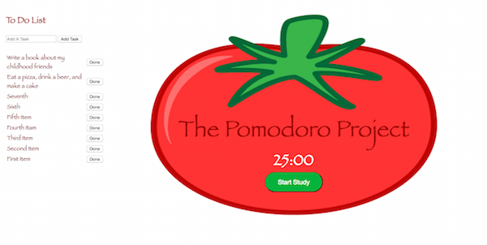

#The Pomodoro Project

##An Application to Help Improve Productivity




The Pomodoro Project is an application modeled after the [Pomodoro Technique](http://pomodorotechnique.com/) aimed to increase your work productivity and quality. The application contains a countdown timer set to 25 minutes that helps you encapsulate your work/study sessions to help you focus on the task at hand followed by a 5 minute break session to help you sharpen your senses and improve overall productivity. This pattern of 25 minute work sessions followed by 5 minute breaks continues with the exception that every fourth break is set to be a 30 minute break.

Also to facilitate and enhance your focus is the ability to create a to-do list on the web application interface. This list is saved to Firebase and will need to be configured with your own credentials in the index.html and saved in a script tag:

````
<script>
  // Initialize Firebase
  var config = {
    apiKey: "yourAPIkey",
    authDomain: "yourFirebaseDomain",
    databaseURL: "yourFirebaseURL",
    storageBucket: "yourFirebase.appspot.com",
    messagingSenderId: "yourSenderId"
  };
  firebase.initializeApp(config);
</script>
````

With Firebase connected, you can add and remove tasks as needed. Having the tasks at hand along with the set timer will help boost you productivity as you are able to focus and apply yourself in measured doses.

----
Built by Valorie with Bloc
